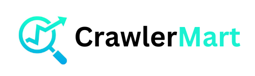
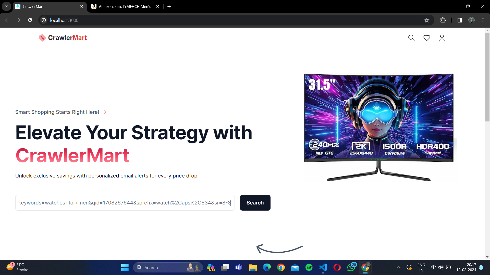
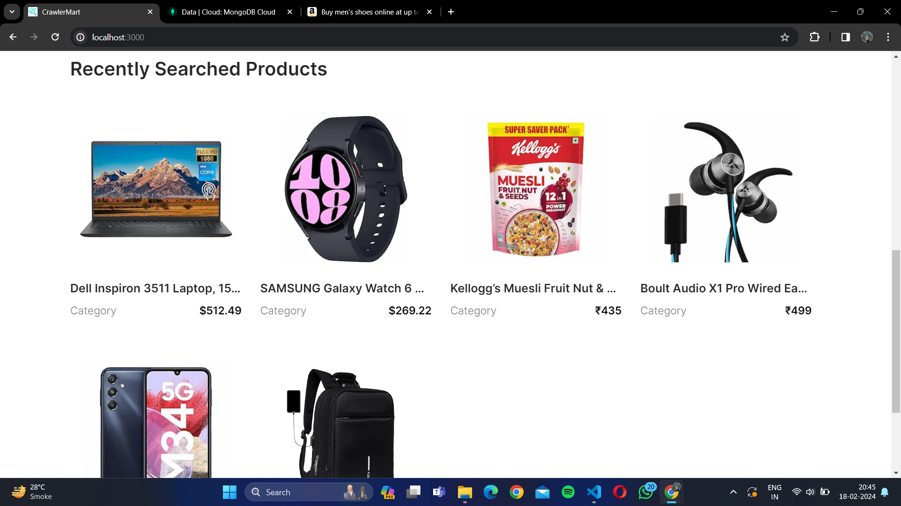
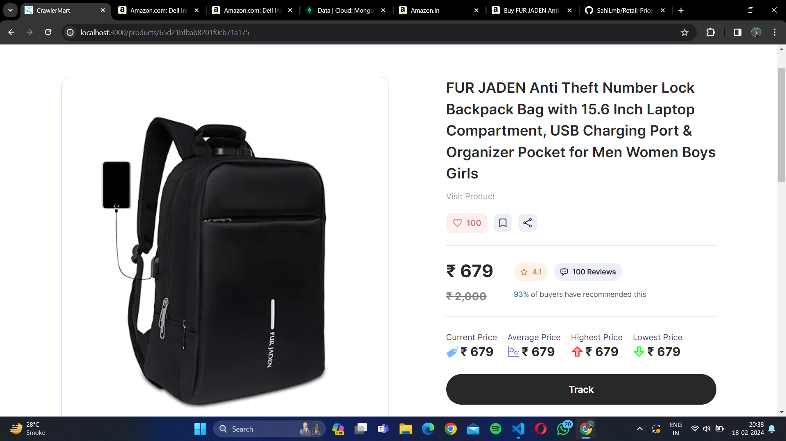
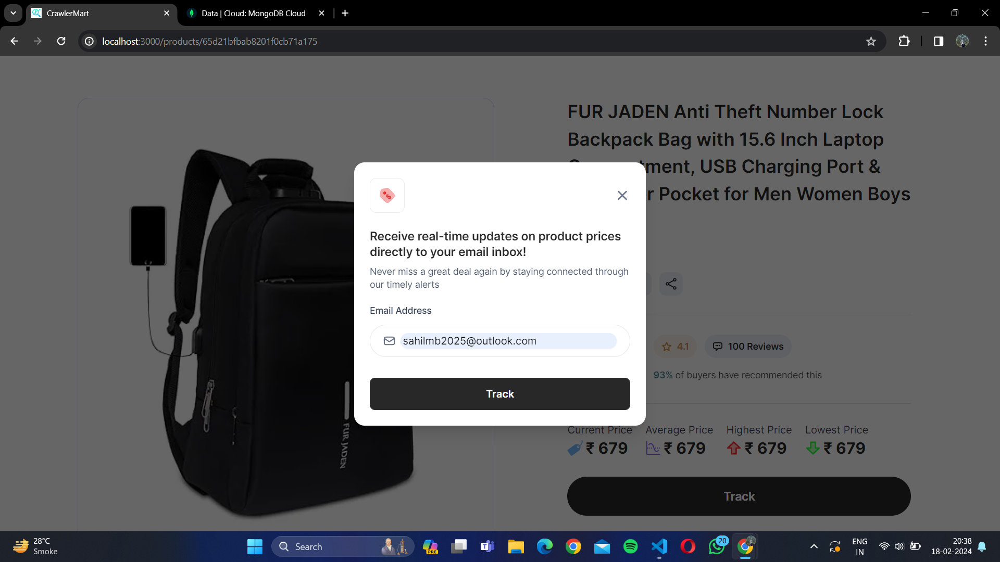
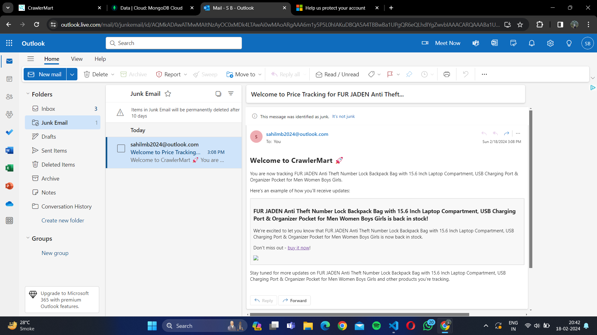
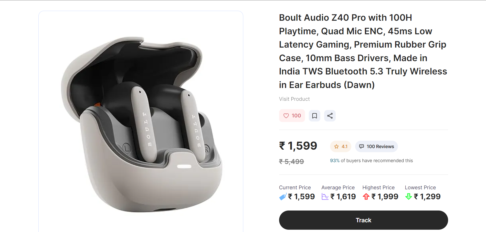
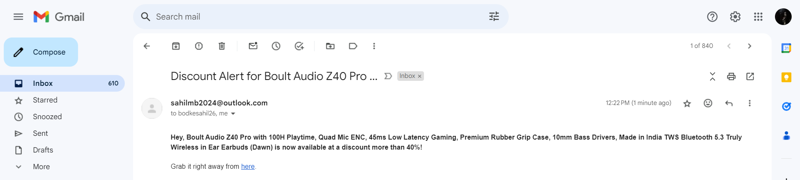

  

  

   
    
    
    
  

<h1 align="center">A web scraping tool used to extract the prices of various products from e-commerce websites like Amazon and display them in the range of Highest, Lowest, Average </h1>
 

Checkout [pricetracker](pricetracker/README.md) for the installation process.

# Overview of whole system

 

  

  

## Home Screen where user gives the url input for product scraping(amazon product url).

  

 

## Recently Searched products saved for ease of tracking in future.

  

 

## Scraped Product Information.

  

 

## User gets a pop-up message regarding tracking of product price through email.

  

 

## Utilised [Nodemailer](https://nodemailer.com/smtp/) for sending mail to user's email address for tracking purpose.

  

 

## Below the product price has been dropped so it will notify the user who enabled tracking for this particular product.

  

 

## Discount mail is sent to the user

  

 

### Future Scope?

- Scraping Amazon Reviews.
- Direct Buying through the platform.
- Particular user curated platform.
